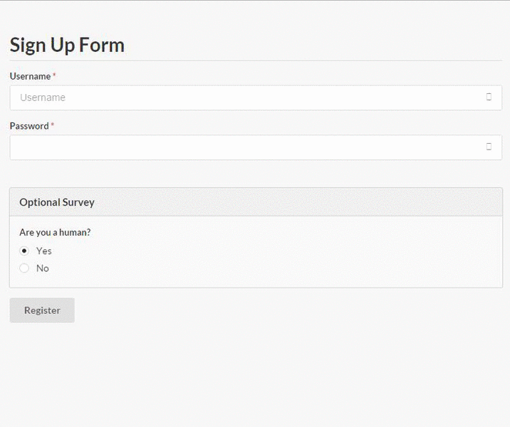
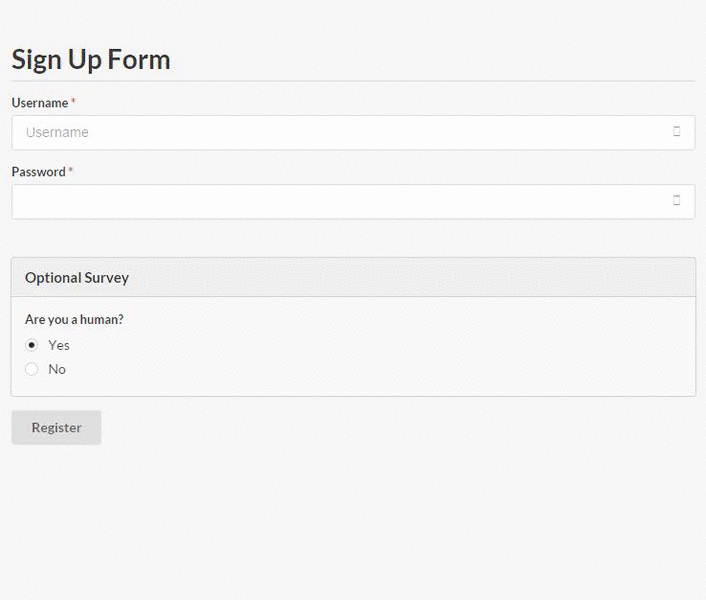
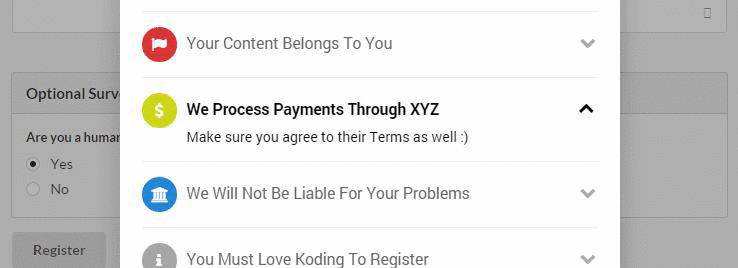
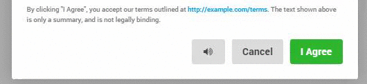
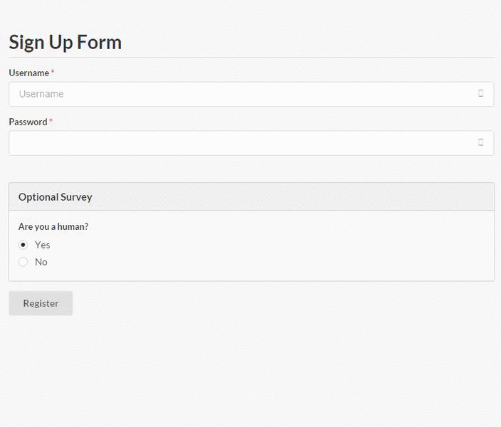
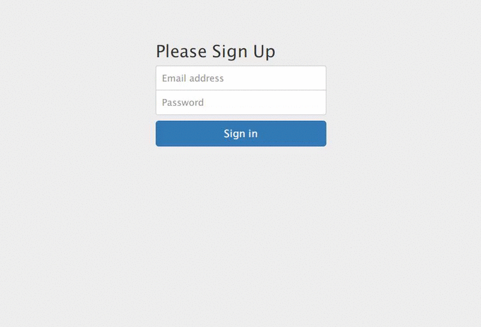

# Unknown Exception's Koding Hackathon's Submission

### Terms.JS - A solution that's both informative to the user and safe to the content creator
## Description

As a web developer, I've had to scrape together Terms and Agreements in the past when a lawyer wasn't available. As someone who's been on both sides of the fence, I've found the user's perspective to be particularly frustrating cause 75% of the Terms and Agreements is often common sense or irrelevant to the user!

To fix this problem, we needs to understand why it exists in the first place.

1. People do not read Terms and Agreements **because they're long and exhaustive**
2. They are *long and exhaustive* to **protect the content creator from legal action and to set ground rules for users**

**So can we make them short?**
The answer is no. This would sacrifice protection for the content creator

**Can we make users read all of it?**
The answer is also no - forcing it would cause users to get fed up and leave.

*Let's face it, there is **no perfect solution.** *

We can't stop users from not reading the Terms and Agreements, but perhaps we can at least make them **aware** of what's relevant to them.

So instead of having them check a box, let's **highlight the main points** and let them read further if they are interested. 

**It's about putting a convenience and choice infront of the user**

[DEMO](http://ukkkb6776eaa.kp1234.koding.io)

## Screenshots

Basic Implementation       |Translation API
:-------------------------:|:-------------------------:
  |  

Dictionary Definitions (Glosbe or Wikipedia API!!)    | 
:-------------------------:|
| 

TTS Capability (TTS-API.COM OR VOICERSS(MASHAPE) API!!)| 
:-------------------------:|
| 

Semantic UI Theme       |Bootstrap Theme
:-------------------------:|:-------------------------:
  |  

## APIs used

**Third Party Services**

1. Yandex.Translate API
2. Glosbe Dictionary API
3. Wikipedia API 
4. TSS-API.COM Free Text to Speech API
5. VoiceRSS (Powered by **Mashape**) Text to Speech API

**Frameworks/Libraries**

1. jQuery
2. Semantic UI
3. Bootstrap
4. Font Awesome
5. LESSCSS

**Other stuff used on the [demo page](http://ukkkb6776eaa.kp1234.koding.io)**

1. SyntaxHighlighter 
